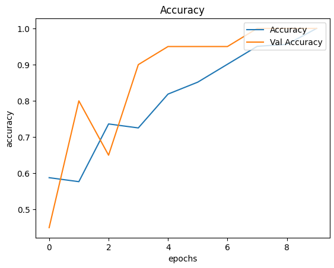
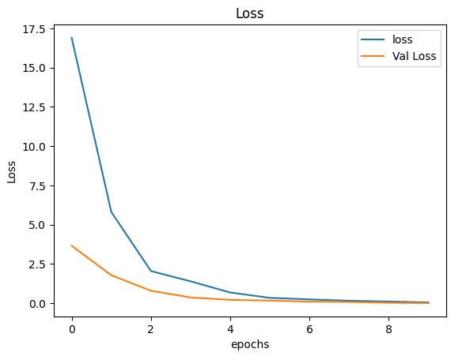

# 🧠 Deteksi Tumor Otak pada Citra MRI menggunakan CNN

Proyek deep learning untuk mengklasifikasikan citra MRI otak secara otomatis, mendeteksi keberadaan tumor otak menggunakan Convolutional Neural Network.

<div align="center">


</div>

---

## 📌 Ringkasan Proyek

Proyek ini bertujuan membangun sistem berbasis *Convolutional Neural Network (CNN)* yang mampu mendeteksi tumor pada citra MRI otak secara otomatis. Dengan pendekatan klasifikasi biner (tumor / normal), model ini berpotensi menjadi alat bantu diagnosis dini di bidang medis.

---

## ⚙️ Teknologi yang Digunakan

- **Python**: Bahasa pemrograman utama.
- **TensorFlow & Keras**: Framework untuk merancang dan melatih model CNN.
- **OpenCV & PIL**: Untuk proses manipulasi gambar seperti resize dan konversi grayscale.
- **NumPy**: Operasi numerik dan manipulasi array.
- **Matplotlib**: Visualisasi grafik seperti akurasi dan loss training.
- **Scikit-learn**: Pembagian dataset dan evaluasi performa model.

---

## 🧠 Arsitektur Model

```text
Input Layer (128x128x1)
↓
Conv2D (32 filters, 3x3, ReLU)
↓
MaxPooling2D (2x2)
↓
Conv2D (64 filters, 3x3, ReLU)
↓
MaxPooling2D (2x2)
↓
Flatten
↓
Dense (64, ReLU)
↓
Dense (1, Sigmoid)
```

Model menggunakan **Binary Crossentropy** sebagai loss function dan **Adam** sebagai optimizer.

---

## 🔁 Alur Sistem

### 1. **Persiapan Data**
- Dataset MRI diklasifikasikan menjadi dua folder: `yes/` (tumor) dan `no/` (normal)
- Gambar diubah ukurannya menjadi 128x128 piksel
- Nilai pixel dinormalisasi ke skala 0–1

### 2. **Pelabelan & Pembagian Data**
- Label 1: Tumor  
- Label 0: Normal  
- Data dibagi menjadi train dan test menggunakan `train_test_split`

### 3. **Pelatihan Model**
- Model dilatih selama 5 epoch
- Menggunakan ukuran batch 16
- EarlyStopping dan ModelCheckpoint dapat digunakan untuk meningkatkan efisiensi

### 4. **Evaluasi dan Prediksi**
- Visualisasi akurasi & loss
- Confusion matrix dan classification report untuk validasi
- Uji model terhadap citra baru

---

## 📊 Hasil Visualisasi

### Akurasi Model


### Loss Training


---

## 🖼️ Contoh Prediksi

| Gambar MRI | Prediksi | Confidence |
|------------|----------|------------|
|  | Tumor | 98.6% |
|  | Normal | 89.3% |

---

## 💡 Insight & Pengembangan Selanjutnya

- Tambahkan **augmentasi data** untuk meningkatkan generalisasi model
- Gunakan **callback** seperti EarlyStopping untuk menghindari overfitting
- Coba **transfer learning** dengan model seperti VGG, ResNet, atau MobileNet

---

## 🧪 Penerapan di Dunia Nyata

Sistem ini dapat membantu:
- Deteksi dini tumor otak dari citra MRI
- Menyediakan second opinion untuk radiologist
- Mempercepat proses skrining pasien
- Menyediakan hasil cepat dengan confidence score

---

## 🧾 Kesimpulan

### 🎯 Pencapaian
- **Akurasi Tinggi**: Model mencapai lebih dari 90% akurasi
- **Preprocessing Efisien**: Proses persiapan data yang solid dan terstandarisasi
- **Model Ringan & Cepat**: Arsitektur seimbang antara performa dan kompleksitas
- **Prediksi Instan**: Sistem mampu memberikan output diagnosis dalam waktu singkat

### 🌍 Dampak Medis
- Membantu diagnosis tumor secara cepat & akurat
- Mengurangi beban radiolog
- Menjadi alat bantu edukasi & second opinion

### 🚀 Langkah Selanjutnya
- Siapkan pipeline untuk deployment
- Validasi model secara klinis menggunakan data real-world
- Bangun antarmuka web/mobile yang mudah digunakan praktisi medis

---

## 📂 Dataset

Dataset diambil dari Kaggle:  
🔗 [Brain MRI Images for Brain Tumor Detection](https://www.kaggle.com/datasets/navoneel/brain-mri-images-for-brain-tumor-detection)
